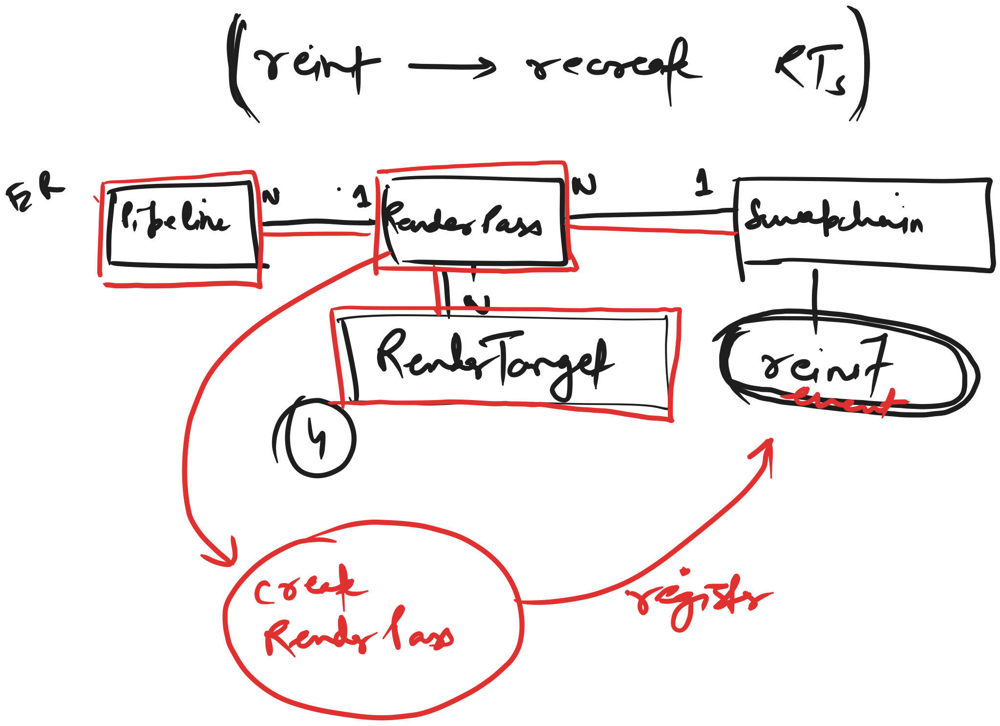

# CrossGui Vulkan Graphics Plugin

## [[**Mon, 29th April 2024**]]

Few more things added while refactoring in commits

- [650f9f6d1ee8765d449e93d8bb2b65071bd21aaa](https://github.com/brightprogrammer/CrossGui/commit/650f9f6d1ee8765d449e93d8bb2b65071bd21aaa)
- [51e7bdd992c72db4ef72947b7c6446d890d8c3fe](https://github.com/brightprogrammer/CrossGui/commit/51e7bdd992c72db4ef72947b7c6446d890d8c3fe)
- [06de3238ae9cec483971ce0372c24e7c4b3ca5ae](https://github.com/brightprogrammer/CrossGui/commit/06de3238ae9cec483971ce0372c24e7c4b3ca5ae)
- [de05dd3726b47c250a7dc68c7eeb7c991ae23a2a](https://github.com/brightprogrammer/CrossGui/commit/de05dd3726b47c250a7dc68c7eeb7c991ae23a2a)

Explanation :

- `RenderTarget` : A `RenderTarget` is where your GPU outputs it's rendering results in different
   subpasses and at the end of the `RenderPass`.
- `RenderPass` : A `RenderPass` handles how different `GraphicsPipeline` objects are executed.
   In other graphics libraries, the `GraphicsPipeline` might be known as `GraphicsPSO` or the
   Graphics Pipeline State Object.
- `GraphicsPipeline` : It is what you think it is :-)

Diagram below explains relationship between `Swapchain`, `RenderPass` and `RenderTargets`, as well
as `GraphicsPipeline`.

The `Swapchain` object stores callback methods provided by the `RenderPass` object that was initialized
using it. The callback method basically is called whenever the swapchain is `reinit`-ed
(like swapchain recreated), to handle the recreation of `RenderTarget` objects as well onwed by
the corresponding `RenderPass`.

This allows the `RenderPass` to own it's `RenderTarget` objects, and it to handle `Swapchain`
reinit events as well while not being very tightly coupled with a `Swapchain`.

## [[**Sat, 27th April 2024**]]

The Vulkan Graphics Plugin works by maintaining a global `Vulkan` state. This allows all parts of
the plugin to have access to commonly shared instance and commonly shared `Device` object. The
shared object is then used to create everything that plugin requires, including surface, swapchain,
buffers, images, framebuffers, renderpasses, descriptor sets/pools, command buffer sets/pools,
in draw calls, etc...

Therefore for now the renderering is performed only on one single device. If we allow each surface
to have it's own logical device handle, then we'd need to create all other resources using that same
device.

So, right now, I don't know the best course of action :

- Should I create all resources like descriptor sets, images, buffers, pipelines, etc... when a
  new window is created?
- Should I just keep using one single device (because that makes things easy and fast).

As an alternative solution is that I should leave out scope for future modification, where I can
allow a `Surface` to have a custom `VkDevice` handle if default `Device` does not support presenting
to it. This seems like a rare case though. Even though I create a `Device` for each `Surface`, that
would mean I'll have to create all objects again and then store it somewhere? Where? That does not
make any sense at all! Because, this would then mean I either store these objects in the `Surface`
itself or somewhere else like `Renderer2D`.

Due to the above decision, when reading the code, keep an eye on whether I'm getting `VkDevice`,
and `VkInstance` handle from function parameter or from `Vulkan` global state :-)
